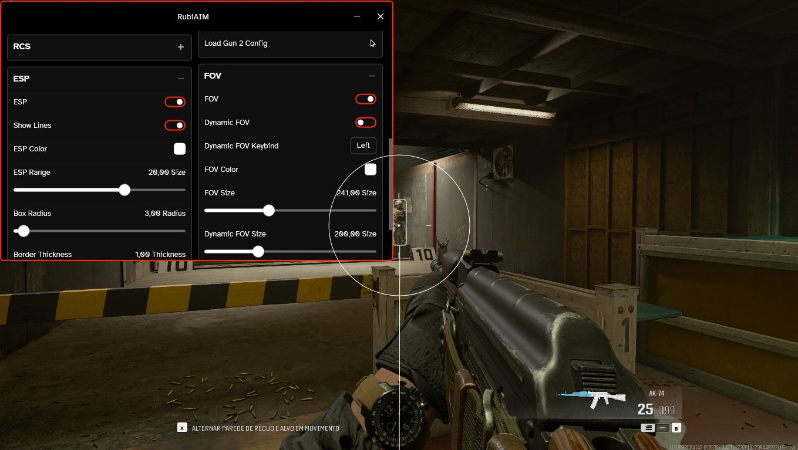

# **WARZONE RUBIAIM V1.0**  

### **ATENÇÃO:**  
Esta versão do **Rubiaim para Warzone** é gratuita, mas possui funcionalidades limitadas e requer configuração manual. Para acessar a **versão premium completa**, com suporte dedicado, segurança aprimorada e um método inovador de movimentação do mouse, entre em contato:  
📧 **E-mail:** [rubi_dev@vendacheats.com](mailto:rubi_dev@vendacheats.com)  
🌐 **Site:** [rubireseller.vendacheats.com](https://rubireseller.vendacheats.com)  

---

## **O QUE É O RUBIAIM WARZONE?**  
O **Rubiaim V1.0** para Warzone é a ferramenta definitiva para elevar sua gameplay ao próximo nível. Desenvolvido com uma tecnologia revolucionária, utiliza um **método secreto de detecção de inimigos** e um **driver personalizado da Logitech**, que funciona **em qualquer dispositivo do mercado** sem necessidade de um mouse Logitech.  

Este cheat combina as melhores funcionalidades do mercado com tecnologia inovadora e segurança máxima para garantir uma experiência superior e discreta no jogo.  

---

## **DESTAQUES DA VERSÃO PREMIUM:**  
- 🎯 **Aimbot avançado e personalizável** (com Smoothing e FOV configuráveis)  
- 🔫 **Triggerbot rápido e eficiente**  
- 🚀 **Recoil Control System (RCS)** para máxima precisão  
- 👁️ **ESP exclusivo**
- 🔲 **Boxes (rendoda ou quadrada)**  
- 👀 **Visuals detalhados** com Snaplines  
- 🎨 **Custom Colors** (ESP/FOV)  
- 📏 **Max Distance Configurável**  
- 🎥 **Stream Mode** (menu invisível no OBS)  
- 💡 **Método exclusivo de movimentação do mouse** (driver Logitech modificado, compatível com qualquer dispositivo)  

---

## **COMO CONFIGURAR A VERSÃO GRATUITA:**  

1. **Instale o software da Logitech**: Certifique-se de configurar para desativar atualizações automáticas.  
2. **Inicie o Warzone**: Coloque o jogo no **modo janela sem bordas** ou **modo janela**.  
3. **Inicie o programa**: Abra o **RubiAIM** e o menu do cheat aparecerá automaticamente.  

---

## **PRÉ-REQUISITOS:**  

- **Windows 10/11** 🇧🇷
- Driver personalizado RubiAIM para movimentação otimizada  
- Configuração no modo janela ou janela sem bordas  

---

## **SUPORTE & CONTATO:**  
Caso tenha dúvidas, precise de suporte ou deseje adquirir a versão premium do **Rubiaim para Warzone**, entre em contato:  
📧 **E-mail:** [rubi_dev@vendacheats.com](mailto:rubi_dev@vendacheats.com)  
🌐 **Site:** [rubireseller.vendacheats.com](https://rubireseller.vendacheats.com)  

---

## **IMPORTANTE:**  

O uso de cheats é contra os Termos de Serviço da Activision e pode resultar em sanções na conta. Este software é disponibilizado para fins educacionais e de entretenimento. Use por sua conta e risco.  
